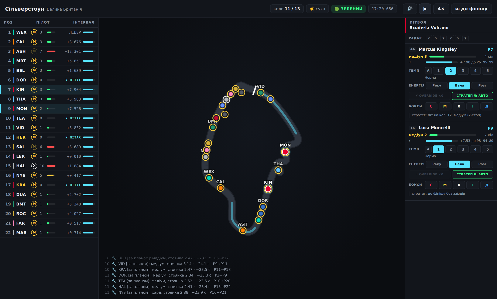
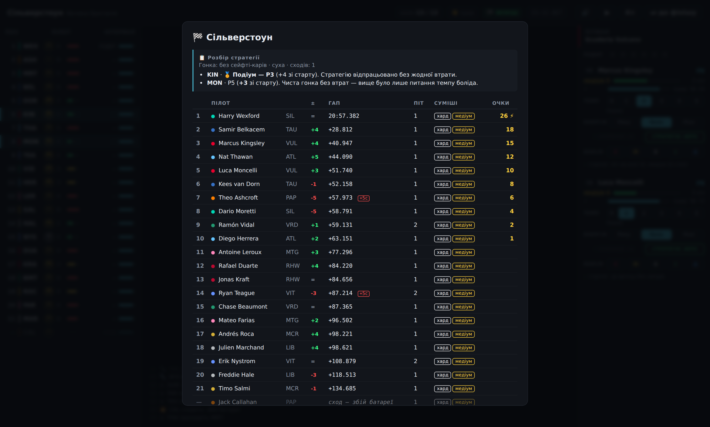

<div align="center">

# 🧀 SCUDERIA MOZARELLA

### F1-менеджер у браузері: гоночний вікенд із пітволу за п'ять хвилин

Сезон-2026 з новим гібридним регламентом · радар погоди, якого не бачить ШІ ·
живий знос гуми всього пелотона · розбір стратегії, що рахує ціну кожного рішення
в секундах · 24 траси · звук трансляції · **працює офлайн**

**[▶ ГРАТИ ПРОСТО ЗАРАЗ](https://everyway123.github.io/scuderia-mozarella/)**

*без встановлення · безкоштовно · PWA: можна встановити на телефон і грати без інтернету*

[](https://github.com/Everyway123/scuderia-mozarella/actions/workflows/pages.yml)
[](LICENSE)



</div>

## In English

**Scuderia Mozarella** is a free browser-based Formula 1 management game.
Run a race weekend from the pit wall in five minutes: tyre strategy with real
degradation cliffs, a weather radar the AI can't see (measured +2.3 positions
per wet race), the 2026 hybrid rules with Override instead of DRS, and a
24-race season with car development, bets and one-shot trump cards. Every
finish comes with a strategy debrief that prices your decisions in seconds.
Built on a lap-by-lap simulation in the spirit of academic race simulation —
same physics for you and the AI, no rubber-banding.

**[▶ Play now](https://everyway123.github.io/scuderia-mozarella/)** — no install,
works offline as a PWA. Interface is currently in Ukrainian; the timing tower,
track map and strategy levers read like any F1 broadcast.

## Чому в це затягує

- **Це не клікер — це пітвол.** Симуляція по колах за схемою академічної
  race-simulation: маса палива, знос гуми з кліфом, брудне повітря, гібрид-2026
  з Override замість DRS. Гра чесна: у суперників та сама фізика, той самий
  планувальник стратегії — і жодного читерського буста.
- **Радар — твоя нечесна перевага.** Прогноз погоди на 6 кіл бачиш тільки ти;
  ШІ реагує на краплі з запізненням. Заїзд на інтер на останньому сухому колі
  дає виміряні **+2.3 позиції за мокру гонку**.
- **Кожна гонка чогось вчить.** Після фінішу — розбір: скільки секунд з'їла
  неправильна гума, чи був твій план оптимальним, «без цих втрат — P4 замість P7»
  і одна конкретна порада.
- **Сезон з характером.** 24 етапи, ставки на своїх пілотів, картки розробки
  з компромісами, одноразові козирі й фірмові траси, які переходять у наступний
  сезон. Аутсайдер фармить очки розробки навіть за відіграні позиції.
- **5 хвилин або 15.** Регулятор довжини гонки: спринт 25% — це вся гонка,
  стиснута вчетверо, з тими самими стратегічними розвилками.

<div align="center">



</div>

## Спробувати зараз

**Онлайн:** [everyway123.github.io/scuderia-mozarella](https://everyway123.github.io/scuderia-mozarella/) —
після першого відкриття працює офлайн; у меню браузера є «Встановити застосунок».

**Локально:**

```bash
npm install
npm run dev                      # гра у браузері (реальний грид 2026)

npm test                         # 115 тестів моделі, балансу, сезону й гейм-дизайну
npm run e2e                      # 20 E2E-сценаріїв у справжньому Chromium
npm run verify                   # типи + юніти + E2E

npm run race                     # headless: Бахрейн, повна дистанція
node scripts/race.ts monza 25 7  # Монца, 25% дистанції, seed 7
npm run balance                  # Monte Carlo по всьому календарю
```

Керування переглядом: `Пробіл` — пауза, `→` — швидкість (1× / 2× / 4× / 8×),
клік по рядку у вежі — стежити за пілотом, межі панелей тягаються мишкою.

> **Статус: MVP+.** Всі критерії готовності закриті — включно з найважчим
> («компетентний гравець стабільно обіграє ШІ», три спростовані гіпотези й
> детектив із інвертованою фізикою дощу). Історія — у [MVP.md](MVP.md).

## Як це грається

**Меню → штаб сезону → гонка → результат → штаб.** Обираєш будь-яку з 11 команд
грида 2026 і ведеш обидві її машини.

На пітволі в тебе три важелі на кожну машину — **темп** (5 рівнів), **енергія**
(рекуперація / баланс / розгортання) і **Override** — плюс піт-стоп із вибором
суміші. Накази діють із наступного кола, як справжнє радіо.

Гра сама зупиняється, коли рішення справді є: сейфті-кар відкрив вікно піту,
пішов дощ, гума підійшла до кліфа, суперник у зоні Override. На відповідь —
дев'ять секунд.

Перед гонкою ставиш **на одного зі своїх пілотів**: його очки рахуються
подвійно, схід — мінус. Після квали видно решітку, і ставку можна перерішити
один раз.

Між етапами вибираєш **одну з трьох деталей**, кожна з компромісом:
«експериментальне крило» дає −0.10 с/коло ціною 35% надійності, «ресурсний
двигун» — навпаки. Плюс три одноразові козирі на сезон і фірмові траси там,
де ти вже вигравав. Прогрес зберігається в браузері.

## Що вже працює

- **Модель кола** за схемою академічної race-simulation (TU München): маса палива,
  знос гуми з кліфом, темп боліда й пілота, брудне повітря, еволюція траси, шум.
- **Гібрид 2026** — MGU-K 350 кВт, рекуперація ~8.5 МДж/коло, Override замість DRS
  (0.5 МДж, лише в межах секунди від суперника). Енергія — третій ресурс поруч
  із гумою й паливом.
- **Обгін як подія**, а не арифметика: швидша машина не «протікає» крізь повільнішу.
  Ймовірність залежить від траси, переваги в темпі, навичок обох пілотів,
  різниці в зносі та Override.
- **Стратег** — повний перебір 1–3 зупинок × усіх комбінацій сумішей за тією ж
  фізикою, що й гонка. Ним користується і ШІ-суперник, і (згодом) підказка гравцю.
- **Випадковість**: сходи, сейфті-кар зі стисненням пелотона, погодний фронт із
  прогнозом, дрібні помилки пілотів. Усе через seeded RNG.
- **Квала** з вибором ризику: безпечно / на межі / ва-банк.
- **Регулятор довжини гонки** 25 / 50 / 100%.
- **Екран гонки**: мінімапа з машинами в справжніх позиціях, зони Override,
  вежа часів із живими інтервалами, сумішами, віком гуми й зарядом батареї,
  командне радіо, плашки подій, прискорення до 8×, класифікація.
- **Пітвол**: темп, енергія, Override, піт-стоп із вибором суміші, ручна
  чи автоматична стратегія — окремо для кожної машини.
- **Сезон**: 24 етапи, залік пілотів і конструкторів, розробка боліда,
  збереження в localStorage.
- **Правило двох сумішей** зі штрафом — без нього «не заїжджати взагалі»
  було найкращою стратегією гонки.
- **Стюарди**: агресивний темп і невдалі спроби обгону карають 5 секундами.
- **Ставка на етап, картки розробки, козирі, фірмові траси** — механіки,
  перенесені з F1 Fantasy та Monopoly F1 (розбір у [DESIGN-BACKLOG.md](DESIGN-BACKLOG.md)).

## Мінімапа: чому траси описані поворотами, а не SVG

Перша спроба була писати контури руками як SVG-шляхи. Вийшли 24 однакові кляксИ —
це видно було одразу, щойно я вивів усі форми на один аркуш і подивився.

Тому траса тепер описується так, як її памʼятає вболівальник: послідовністю
«пряма такої довжини — поворот на стільки градусів». Контур будує код, і характер
кільця зʼявляється сам: Монца витягується в прямі, Ред-Булл-Ринг стає трикутником,
Баку отримує свою кілометрову пряму, Джидда — довгу вузьку петлю вздовж
корніша, де есси гасять один одного і сторони лишаються швидкими прямими.

Дві корекції роблять із довільного опису замкнене кільце: кути масштабуються до
суми рівно 360°, а залишкова невʼязка розмазується вздовж контуру. Шов згладжується
локально — рівномірна релаксація зʼїдала характер і перетворювала все на яйце.

Це стилізація, не геодезія: іконічні кільця впізнаються за силуетом, кілька
середняків досі схожі між собою.

## Стиснення мусить бути повним, інакше важелі нічого не важать

Найдорожча знахідка MVP. Спершу стиснення чіпало лише гуму й паливо. Замір
показав, що в такій гонці **пасивна гра обігравала будь-яку стратегію**: знос
наприкінці стінта давав десяток секунд на колі, а важіль темпу — пів секунди.
Рішення гравця тонули в шумі.

Причина проста, щойно її побачиш: у стиснутій гонці одне коло «коштує» c
справжніх, тож на c треба множити **все**, що накопичується за дистанцію —
темп, енергію, брудне повітря, перевагу боліда, ризик сходу. Шум при цьому
росте як √c, бо це сума незалежних кіл, а піт-стоп не масштабується взагалі:
двадцять секунд у боксах лишаються двадцятьма секундами.

## Дві речі, які довелось робити не так, як здавалось

**Порядок у вежі потребує гістерезису.** Позиція рахується за пройденою дистанцією,
тому обгін видно посеред кола, а не на лінії. Але під сейфті-каром, де пелотон
стоїть у 0.9 секунди, сусіди перестрибували один одного щокадру — вежа безперервно
смикалась, і жоден справжній обгін у цьому шумі не читався. Тепер порядок міняється
лише коли перевага перевищує ~0.2 с; решта — шум інтерполяції.

**Мапа розсовує машини, вежа — ні.** Гапи в 0.3 секунди чесні, але на контурі кільця
22 машини в такому поїзді зливаються в одну пляму. Для картинки сусіди рознесені
на мінімальну відстань зі збереженням порядку; цифри у вежі лишаються справжніми.

## Регулятор довжини — це стиснення, а не обрізання

Найважливіше архітектурне рішення M1. Гонка на 25% — не «перші 14 кіл із 57»,
а вся гонка, стиснута вчетверо: одне коло «коштує» чотири справжніх, тож гума
й паливо витрачаються пропорційно швидше.

Без цього спринт вироджувався: піт-стоп коштує ті самі 20 секунд, а відігравати
їх нема на чому — і оптимальною стратегією ставало «поставив харди й доїхав».
Тест `strategy.test.ts` це ловив: розрив між найкращими стратегіями сягав 19 секунд.

Тонкість, на якій перша спроба провалилась: знос накопичується **квадратично**
за стінт (втрата на колі росте з віком гуми). Тому проста складова масштабується
на `c`, а лінійна по віку — на `c²`. Інакше стиснута гонка втрачає всю гумову драму.

## Калібрування — по кожній трасі, не в середньому

Одне усереднене число по календарю нічого не доводить: воно однаково
задоволене і правильною моделлю, і такою, де в Монако шістдесят обгонів,
а в Монці п'ять. Тому кожна траса має власний профіль, і саме він
перевіряється в `balance.test.ts` — 17 окремих тестів плюс перевірки
впорядкованості.

480 гонок Monte Carlo, повна дистанція (`npm run balance -- 20`):

| Траса | Обгони | Піт | Сходи | SC | Дощ | Реальний характер |
|---|---|---|---|---|---|---|
| Монако | **9** | 1.51 | 2.15 | 0.95 | 40% | обігнати неможливо, одностоп, найбільше SC |
| Хунгароринг | 23 | 2.22 | 2.25 | 0.65 | 15% | «Монако без стін», високий знос |
| Лусаїл | 34 | 2.00 | 2.15 | 0.45 | **0%** | пустеля, гуму їсть |
| Судзука | 36 | 1.49 | 1.50 | 0.50 | 35% | швидко, але вузько |
| Марина-Бей | 36 | 1.56 | 1.90 | 0.45 | 40% | вулиці, тропічні зливи |
| Джидда | 36 | **1.36** | 2.00 | 0.60 | 5% | стіни, майже без гальмувань |
| Зандворт | 39 | 1.84 | 1.75 | 0.55 | 20% | дюни, вузько |
| Лас-Вегас | 39 | 1.53 | 2.55 | 0.20 | 20% | прямі, холодний асфальт |
| Спа | 40 | 1.70 | 2.00 | 0.25 | **50%** | Арденни, погода змінюється щогодини |
| Барселона | 41 | **2.34** | 1.95 | 0.35 | 5% | еталон зносу, класичний двостоп |
| Альберт-Парк | 42 | 1.53 | 1.70 | 0.60 | 15% | парк, стіни близько |
| Мадринг | 42 | 1.52 | 1.90 | 0.45 | 20% | новачок 2026 |
| Сахір | 43 | 2.04 | 2.30 | 0.55 | **0%** | три зони обгону, високий знос |
| Монца | 45 | 1.49 | 2.10 | 0.35 | 25% | храм швидкості, одностоп |
| Сільверстоун | 45 | 1.65 | 2.00 | 0.70 | **45%** | швидкі дуги, британська погода |
| Яс-Маріна | 46 | **1.35** | 1.60 | 0.30 | **0%** | фінал сезону, низький знос |
| Шанхай | 47 | 1.73 | 2.20 | 0.50 | 50% | довга пряма |
| Маямі | 48 | 1.51 | 2.50 | 0.45 | 10% | швидкий центр |
| Америкас | 49 | 1.77 | 2.00 | 0.60 | 25% | змійка й довга пряма |
| Інтерлагос | 51 | **2.60** | 1.75 | 0.40 | 50% | найвищий знос календаря |
| Баку | 51 | 1.37 | 1.80 | 0.30 | 15% | кілометрова пряма |
| Жіль-Вільнев | 52 | 2.28 | 2.40 | 0.45 | 45% | Стіна чемпіонів |
| Ред-Булл-Ринг | **55** | 2.50 | 2.25 | 0.45 | 45% | коротке коло, три прямі |
| Ерманос-Родрігес | **57** | 1.95 | 1.75 | 0.65 | 20% | найдовша пряма на висоті |

Усереднено по календарю: 41.9 обгону, 2.02 сходу, 0.49 сейфті-кара,
1.78 піт-стопа на машину, 25% гонок із опадами — усе в реальних діапазонах Ф1.

Ключові константи — у `src/sim/constants.ts`, характер трас — у
`src/data/tracks2026.ts`.

### Дві помилки, які ховало усереднення

**Сходи залежали від кількості кіл.** Ризик задавався на коло, тож Монако
з його 78 колами видавало вдвічі більше сходів, ніж Спа з 44 — просто через
довший список. Реальні гонки Ф1 однакові за дистанцією, тож ризик тепер
задається **на гонку** й ділиться на її довжину.

**Планувальник не бачив ціни втраченої позиції.** Він рахував чистий час —
і виходило, що двостоп оптимальний на 19 із 24 трас. У житті це не так саме
тому, що після боксів треба ще когось проїхати: у Монако це неможливо,
у Монці — дрібниця. Додана ціна зайвого заїзду, обернена до легкості обгону,
і розклад став схожим на справжній сезон: Монако, Монца, Спа, Баку, Вегас —
одностопові; Бахрейн, Барселона, Катар, Зандворт, Австрія — двостопові.

## Структура

```
src/sim/     чиста детермінована симуляція, ЖОДНОГО DOM
  rng.ts          mulberry32 + gaussian
  types.ts        типи
  constants.ts    ← усі калібрувальні числа тут
  tyres.ts        знос, кліф, стиснення
  energy.ts       гібрид 2026, Override
  lapModel.ts     формула часу кола
  overtaking.ts   дуель за позицію
  incidents.ts    сходи, SC, погода, помилки
  strategyAI.ts   планувальник і рішення стратега
  qualifying.ts   квала
  raceEngine.ts   крок гонки, розв'язання позицій

src/data/    ЄДИНЕ місце з реальними назвами — замінне цілком
  teams2026.ts     11 команд
  drivers2026.ts   22 пілоти
  tracks2026.ts    24 траси

src/season/  сезон, залік, розробка, збереження

scripts/     headless-інструменти
tests/       115 тестів: детермінізм, модель кола, баланс по кожній трасі,
             стратегії, гейм-дизайн, повний сезон, ринок пілотів
e2e/         20 сценаріїв Playwright у справжньому Chromium
```

До цього додається шар відображення, який симуляція не бачить:

```
src/race/
  replay.ts        міст: накопичує знімки кіл, віддає стан на будь-яку секунду
  TrackMap.ts      canvas: контур, зони Override, машини
  TimingTower.ts   вежа часів
  PitwallPanel.ts  важелі гравця
  RadioFeed.ts     командне радіо й плашки подій
  RaceView.ts      годинник гонки, моменти рішення, керування
src/data/trackShapes.ts   контури трас із описів поворотами
```

**Симуляція повністю відокремлена від рендеру.** `Race.step()` — крок без браузера
й без таймерів, тому 288 гонок рахуються за 0.8 секунди. Анімація — це просто
інтерполяція між станами кіл у `replay.ts`; движок про існування екрана не знає.

## Про реальні назви

Команди й пілоти 2026 — чужі торгові марки. Для приватного пет-проєкту це нормально;
публічна збірка натомість використовує **вигаданий грид**: `VITE_GRID=fictional`
підміняє видимі назви й імена (Silberstern GP, Harry Wexford…) на мапах із
`src/data/fictional.ts`, зберігаючи id, баланс і сумісність збережень.
Саме так збирає гру workflow GitHub Pages. Дефолтна локальна збірка — реальний грид.

## Офлайн

Гра — PWA: маніфест, іконки і service worker у `public/`. Після першого
відкриття з будь-якого https-хостингу вона кешується цілком і працює без
мережі; з меню браузера її можна «Встановити» як застосунок. Збірка з
відносними шляхами (`base: './'`) працює і просто з диска як `file://`.
Кожен пуш у `main` збирає публічну версію на GitHub Pages
(`.github/workflows/pages.yml`) — для приватного репо потрібен план із Pages
або публічна видимість.

## Кар'єра і ринок пілотів

Сезон не закінчується фіналом. У міжсезонні відкривається **ринок**: 4–7
вільних агентів (детерміновано від seed сезону), гравець може підписати
одного замість одного зі своїх — простий обмін місцями, без дір у гриді.
Ціна платиться очками розробки наступного сезону, зірки вимагають команду
з топ-4/топ-7 кубка. Кого не взяв — розбирають суперники. Форма дрейфує
з віком: молодь росте, ветерани здають. Фірмові траси і до 10 RP
переносяться в наступний сезон.

## Що далі

Розбір механік із **F1 Fantasy** і **Monopoly F1** — що перенесено
і чому, а що відкинуто — у [DESIGN-BACKLOG.md](DESIGN-BACKLOG.md).

## Ліцензія

[MIT](LICENSE) — код вільний для будь-якого використання. Реальні назви команд
і імена пілотів у `src/data/` — чужі торгові марки й персональні бренди, ліцензія
на них не поширюється; публічна збірка тому використовує вигаданий грид.
